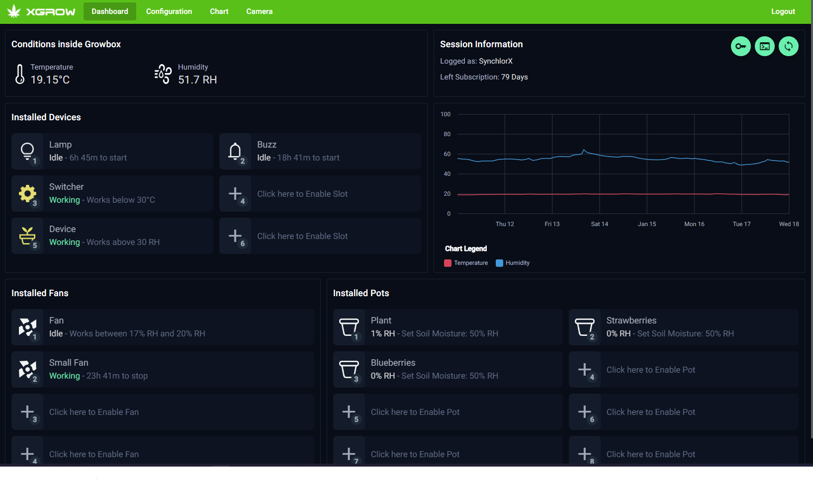
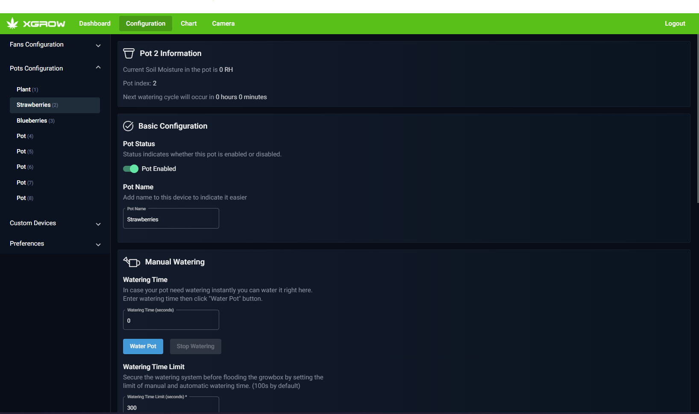
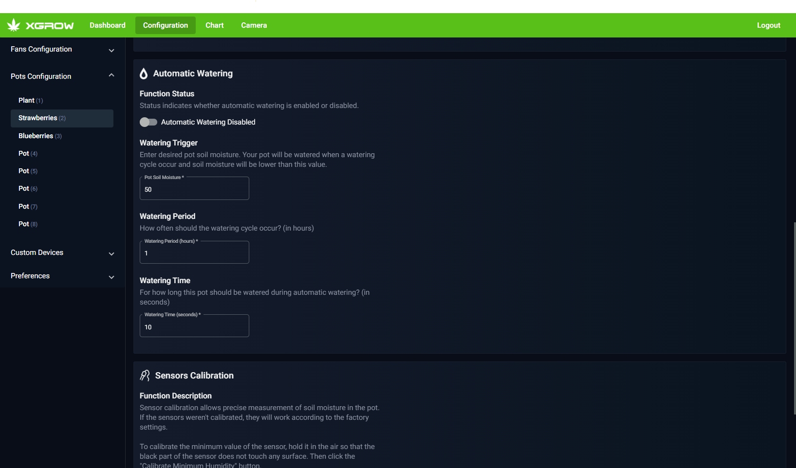
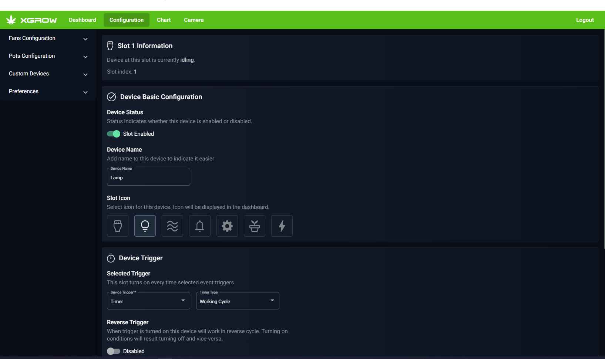
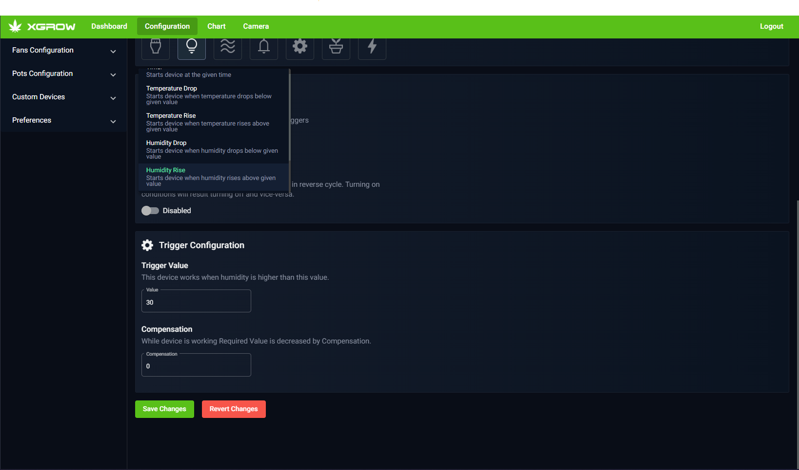
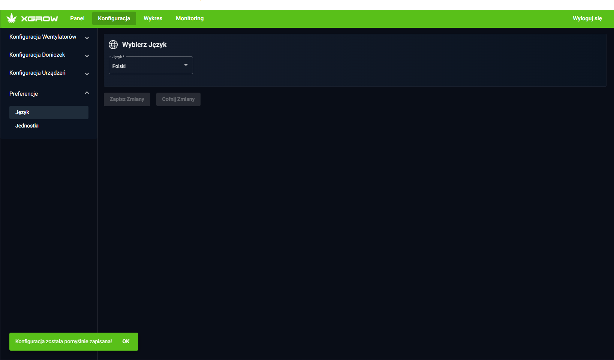
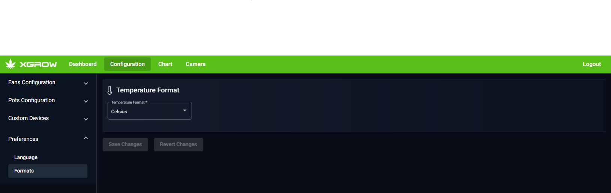
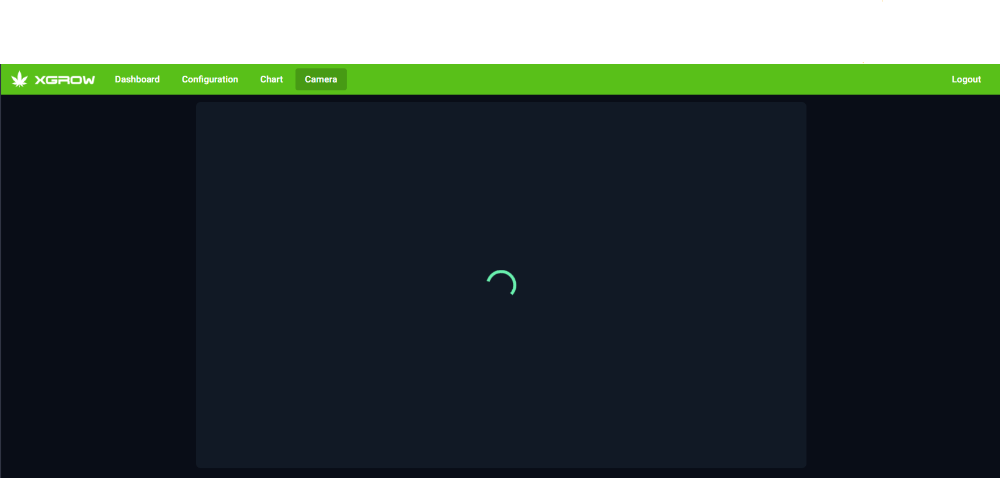
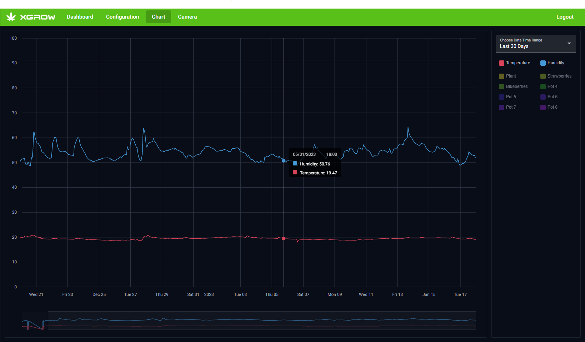
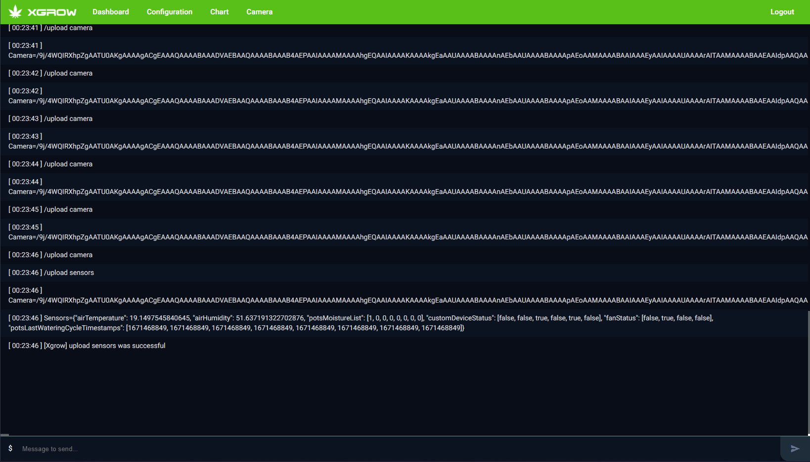

<h1 align="center">
   
  
   
  Xgrow | Plant Caring System
   
</h1>

<h4 align="center">Xgrow is a smart home solution for people that don't have much time to care for their plants. I've made a web application for this device that allows you to control the xgrow machine nad read various data.</h4>

  <a href="#key-features">Key Features</a> •
  <a href="#deployed-app">Deployed App</a>

## Key Features

- Live data preview - temperature, humidity, soil moisture and much more!
- Reactive Forms that allow user to configure every aspect of the device.
- NgRx state management library.
- Interactive charts made with ngx-charts library
- REST api and websocket solutions.
- Shell with several commands for more advanced device users.
- Clean and simplistic graphical layout.
- Internationalized application (used ng-translate).
- Authentication & Subscription system.
- Live camera preview.
- Information logging system.

## Deployed App

You can view the app here:
https://xgrow.pl/

## Dashboard

The dashboard page contains most crucial information about about the devices and plants:

- Conditions inside growbox - temperature and humidity.
- Currently logged user information.
- Chart that shows the temperature and humidity from last 7 days.
- Information about currently working devices and fans and their turn-on requirements.
- Information about watered pots, their soil moisture and auto-watering requirements.

From the dashboard users can do following things:

- Refresh data (new data is fetched directly from Xgrow device).
- Enter pot, device or fan configuration page.
- Extend their subscription.
- Enter shell.

## Pots Configuration

Inside the pots configuration users can:

- Check current soil moisture and next watering cycle time.
- Disable/Enable pot.
- Set pot name.
- Water pot manually.
- Configure automatic-watering.
- Configure sensors that read soil moisture.

## Fans and Devices

Inside the fans & device configuration users can:

- Check whether the device is turned on.
- Disable/Enable device.
- Set device icon and name.
- Configure when the devices are running (through events system). Detailed configuration is different depending on the selected event:
  - Temperature Rise/Drop/Range
  - Humidity Rise/Drop/Range
  - Timer (supports working hours and working cycle)

## Preferences Forms

Each user can select the language and formats that are displayed in the app:

- Temperature (Fahrenheit or Celsius)
- Language (English or Polish)

## Camera
Users can check out the plants conditions remotely through the live camera feature.

## Charts
Xgrow stores the data up to one year. Users can preview and analyze this data in the interactive chart.

## Shell
For advanced users there's a shell system that allows users to send commands that'll change device configuration.

